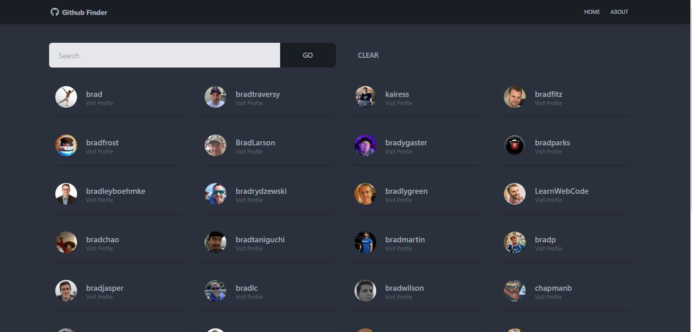

# Getting Started with Create React App

This project was bootstrapped with [Create React App](https://github.com/facebook/create-react-app).

## Table of contents

- [Overview](#overview)
  - [Screenshot](#screenshot)
  - [Links](#links)
  - [Built with](#built-with)
  - [What I learned](#what-i-learned)
- [Author](#author)

## Overview
This is webpage that can be used to search through github users and view their personal information and repositories.
### Screenshot

### Links

- Solution URL: [https://github.com/PrincessMaggy/github_finder.git]
- Live Site URL: [https://princessmaggy.github.io/github_finder]

### Built with

- React
- Redux
- CSS custom properties
- Tailwind
- Daisy UI

### What I learned
- ...

## Author

- Website - [Maggy](https://princessmaggy.github.io/My-Portfolio/)
- Frontend Mentor - [@Maggy](https://www.frontendmentor.io/profile/princessmaggy)
- Twitter - [@princessMaggy7](https://www.twitter.com/princessMaggy7)

